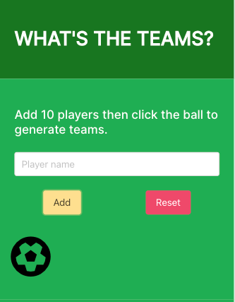

# Team-Picker

## Description

A simple app for footy players to generate random 5-aside teams.

## Table of Contents

- [Installation](#installation)
- [Usage](#usage)
- [License](#license)
- [Contributing](#contributing)
- [Tests](#tests)
- [Questions](#questions)

## Installation

no installation needed

## Usage

Navigate to https://mattmc86.github.io/5asideTeamPicker/
Enter one player at a time and then once ten are added click the ball icon which will generate two random teams. It will also provide the weather and latest tweets from my local power league in Gateshead.

## License

https://opensource.org/licenses/MIT
This project is under the license of MIT

## Contributing

If you want to contribute, please get in touch.

## Tests

no tests

## Questions

If you have any questions about this project, you can contact me at matthewmckenna1986@hotmail.com. More projects available here https://github.com/mattmc86.
